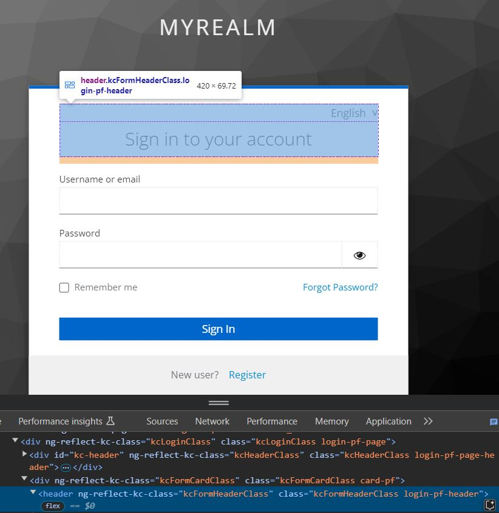

# Editing or Removing Keycloak Styles


For CSS Level Customization Keycloak provides a standardized way of customization through the use of _theme.properties._ This way Keycloak provides a basic theme.\
Follow this tutorial if you want to port an existing theme or develop a new theme based on the Keycloak Base Theme and **without having to overwrite the pages**


## Styling a Keycloak Class with CSS

Upon inspecting the DOM in your login theme you can see that an element usually has a class starting with _kc_ in this case _kcFormHeaderClass._ The succeeding class _login-pf-header_ represents Patternfly styles and is mapped by the _kcFormHeaderClass._

<figure><figcaption><p>The header element has multiple classes</p></figcaption></figure>

If you want to add a red border to the header class you can do so by directly overwriting the Keycloak CSS class in your _styles.css_


```css
.kcFormHeaderClass {
    border: 3px solid red;
}
```


<figure><figcaption><p>Login Header with red border</p></figcaption></figure>

## Styling a Keycloak Class with Custom Class Bindings

There are mutliple scenarios where you want to bind custom classes:

1. Applying Patternfly, Tailwind or Bootstrap classes
2. Applying your own CSS Classes

Let's say that we would like to add a red border to the header element of the login page but with a class _red-border_ instead of applying the style directly.

You can define a CSS class and bind it using the classes array in your KcPage. You can also bind any other class from e. g. Patternfly , Tailwind or Boostrap&#x20;


```css
.red-border {
    border: 3px solid red;
}
```



```tsx
const classes = {
  kcFormHeaderClass: "login-pf-header red-border",
} satisfies { [key in ClassKey]?: string };
```


<figure><figcaption><p>Login Header with red border</p></figcaption></figure>

## Removing a Default Style

Keycloakify enables you to use this Keycloak concept to easily edit the default styles. For example let's remove the _login-pf-header_ class:



<pre class="language-tsx" data-title="src/login/KcPage.tsx"><code class="lang-tsx">const classes = {
<strong>    kcFormHeaderClass: ""
</strong>} satisfies { [key in ClassKey]?: string };
</code></pre>




```typescript
const classes = {
    kcFormHeaderClass: ""
} satisfies { [key in ClassKey]?: string };
```




We can see that now, the header element has no other class binding than _kcFormHeaderClass_ as we removed the _login-pf-header_ class. As a result the header text is now aligned to the left.

<figure><figcaption><p>Now the header has only one class</p></figcaption></figure>


## Removing all Default Styles

Maybe you'd prefer to remove all default styles at once you can do that by setting _doUseDefaultCss_ to false. This option is also available to set on a per page basis.



<pre class="language-tsx" data-title="src/login/KcPages.tsx"><code class="lang-tsx">export default function KcPage(props: { kcContext: KcContext }) {

    return (
        &#x3C;Suspense>
            {(() => {
                switch (kcContext.pageId) {
                    default:
                        return (
                            &#x3C;DefaultPage
                                kcContext={kcContext}
                                i18n={i18n}
                                classes={classes}
                                Template={Template}
<strong>                                doUseDefaultCss={false}
</strong>                                UserProfileFormFields={UserProfileFormFields}
                                doMakeUserConfirmPassword={doMakeUserConfirmPassword}
                            />
                        );
                }
            })()}
        &#x3C;/Suspense>
    );
}
</code></pre>



<pre class="language-typescript" data-title="src/login/KcPage.ts"><code class="lang-typescript">const classes = {} satisfies { [key in ClassKey]?: string };
<strong>const doUseDefaultCss = false;
</strong>const doMakeUserConfirmPassword = true;

export async function getKcPage(pageId: KcContext['pageId']): Promise&#x3C;KcPage> {
  switch (pageId) {
    default:
      return {
        PageComponent: await getDefaultPageComponent(pageId),
        TemplateComponent,
        UserProfileFormFieldsComponent,
        doMakeUserConfirmPassword,
        doUseDefaultCss,
        classes,
      };
  }
}

</code></pre>





However be aware that re-styling everything involves quite a bit of work:

<figure><figcaption><p>The login page with doUseDefaultCss set to false</p></figcaption></figure>

