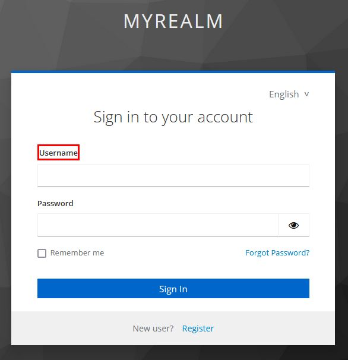

# Using Keycloakify I18n


This documentation explains how i18n works in the Login theme.\
\
In the Account Multi-Page theme, everything works the same as in the Login theme. You just need to replace **/login/** by **/account/** in the import paths. &#x20;

\
In the Account Single-Page theme, things works differently. [See relevent doc](../account-theme/single-page.md#i18n-internationalization-and-translation).


If you [eject some pages](../customization-strategies/component-level-customization/), you'll see in your component how the internationalization is actually implemented:



<pre class="language-tsx" data-title="src/login/Register.tsx"><code class="lang-tsx">export default function Register(props: RegisterProps) {
    const { i18n } = props;
    
    const { msg, msgStr, advancedMsg, advancedMsgStr } = i18n;

    return (
        &#x3C;label htmlFor="username" className={kcClsx("kcLabelClass")}>
<strong>            { msg("username")}
</strong>        &#x3C;/label>
    );
}
</code></pre>



<pre class="language-html" data-title="login.component.html"><code class="lang-html">&#x3C;label
    for="username"
    [kcClass]="'kcLabelClass'"
>
<strong>    {{ i18n.msgStr('username') }}
</strong>&#x3C;/label>
</code></pre>



<figure><figcaption></figcaption></figure>

## Displaying messages that contain HTML

If you want to see the base message translations you can navigate to the **node\_modules/keycloakify/src/login/i18n/messages\_defaultSet/** directory. As you can see, the value translation for the key _errorTitleHtml_ in English (**en.ts**) is:

`errorTitleHtml: We are <strong>sorry</strong> ...`

How can we display this key while also applying the mark-up?

<figure><figcaption><p>Don't edit this file directly, it's just for seeing what are the default set of i18n messages!</p></figcaption></figure>



If you want to display this message you can call `msg("errorTitleHtml")`\
This method returns a **JSX.Eement.** The resulting DOM tree looks like this:

```html
<div data-kc-msg="backToLogin">
    We are <strong>sorry</strong> ...
</div>
```


The `data-kc-msg` attribute is only here to help you find the source code that generates this node when inspecting with the browser dev tools.\
Note also that the text that is going to be rendered is:

We are **sorry** ... (with sorry in bold)




In Angular you need to use the _kcSanitize_ function and bind the message as an innerHTML to render the element:

```html
    <p
        [innerHTML]="i18n.msgStr('errorTitleHtml') | kcSanitize: 'html'"
    ></p>
```



